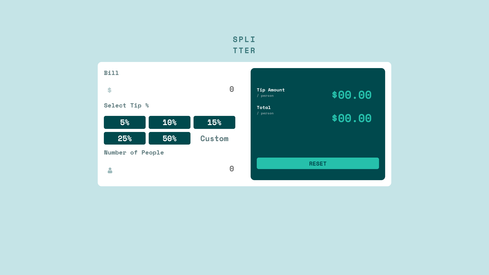

# Frontend Mentor - Tip Calculator

This is a solution to the [Tip calculator app challenge on Frontend Mentor](https://www.frontendmentor.io/challenges/tip-calculator-app-ugJNGbJUX). This project was made using SCSS, vanilla Javascript, and Vite as a build tool. My main goal for this project was writing clear, easy to understand, code. The SCSS especially was refactored with great attention to clarity.

## Overview

### The challenge

Users should be able to:

- Enter the bill amount
- Select a tip percentage from predefined options or enter a custom tip percentage
- Enter the number of people sharing the bill
- View the calculated tip amount per person and total amount per person
- See an error message if the number of people is set to zero
- Reset the calculator to start a new calculation

### Screenshot

## My process

### Built with

- Semantic HTML5 markup
- SCSS custom properties
- CSS Grid
- Mobile-first workflow
- Vite Build Tool

## Author

- Frontend Mentor - [dev-jlagunas](https://www.frontendmentor.io/profile/dev-jLagunas)

## Contact

For any questions or concerns, please contact Juan Lagunas at dev.jlagunas@gmail.com

## License

[MIT](https://choosealicense.com/licenses/mit/)
